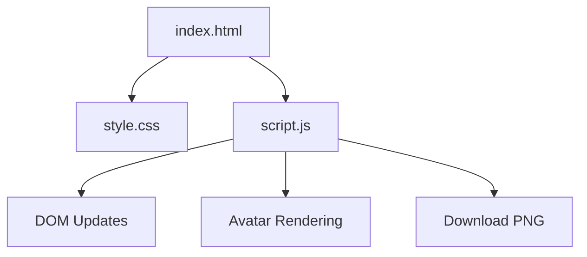

# Project Architecture

---

## Overview

Avatar Creator is a browser-based web application that allows users to create simple customizable avatars. Users can modify the background color, skin tone, hair color, and hairstyle, generate a random avatar, and download the final avatar as a PNG image. The project is built using HTML, CSS, and Vanilla JavaScript without any external frameworks.

---

## Purpose & Goals

- Demonstrate DOM manipulation using Vanilla JavaScript.
- Allow users to customize avatars interactively.
- Provide an easy-to-understand mini project for beginners.

---

## Folder Structure

```text
avatar-creator/
├── index.html      # Main webpage
├── style.css       # Styling for the application
├── script.js       # Avatar generation and interactions
└── ARCHITECTURE.md # Project architecture documentation
```

---

## System / Project Architecture Overview

The application follows a simple client-side architecture. HTML provides the page structure, CSS handles the appearance, and JavaScript manages avatar generation, customization, randomization, and downloading.



---

## Component Breakdown

| File | Responsibility |
|------|----------------|
| `index.html` | Defines the UI structure and controls |
| `style.css` | Handles layout, colors, and styling |
| `script.js` | Controls avatar rendering, customization, and download |
| `ARCHITECTURE.md` | Project documentation |

---

## Data Flow / Execution Flow

```text
User opens index.html
        ↓
Browser loads CSS and JavaScript
        ↓
Avatar is rendered with default settings
        ↓
User changes colors or hairstyle
        ↓
JavaScript updates the avatar instantly
        ↓
User downloads the generated avatar
```

---

## Key Features

- Customizable background color
- Customizable skin tone
- Customizable hair color
- Multiple hairstyle options
- Random avatar generation
- Download avatar as PNG

---

## Technologies Used

| Technology | Purpose |
|------------|---------|
| HTML5 | Structure of the webpage |
| CSS3 | Styling and layout |
| JavaScript (ES6) | Avatar generation and interactions |
| SVG | Rendering avatar graphics |
| Canvas API | Exporting avatar as PNG |

---

## File Responsibilities

### `index.html`

- Defines the application layout.
- Contains controls for customization.

### `script.js`

- Generates avatar graphics.
- Updates avatar on user interaction.
- Randomizes avatar attributes.
- Downloads avatar as PNG.

### `style.css`

- Styles the page.
- Makes the layout clean and responsive.

---

## Design Decisions

- **Vanilla JavaScript** was used to keep the project lightweight and beginner-friendly.
- **SVG rendering** was chosen because it allows easy customization of avatar elements.

---

## Dependencies

None. This project uses only native browser APIs.

---

## Future Improvements

- Add more hairstyles.
- Add accessories like glasses and hats.
- Improve mobile responsiveness.

---

## Known Limitations

- Limited hairstyle options.
- No backend or cloud storage.

---

## Development Notes

- No build process is required.
- Open `index.html` in a browser or run using a local server.

---

## References

- MDN Web Docs — SVG
- MDN Web Docs — Canvas API