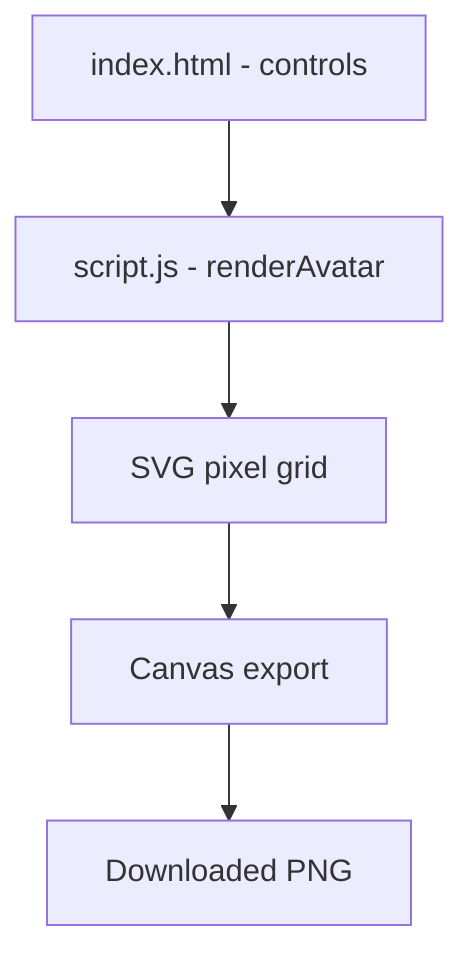

# Project Architecture

## Overview

Pixel Avatar Creator is a browser-based tool that lets users design a custom
blocky, pixel-art-style avatar by picking colors and hairstyles, then export
the result as a downloadable PNG. It runs entirely client-side with no
backend or external dependencies.

---

## Purpose & Goals

- Let users create a personalized pixel-art avatar in under a minute
- Demonstrate how to build pixel-grid graphics using raw SVG rectangles instead of images
- Keep the codebase small and dependency-free so a first-time contributor can read it in under 15 minutes

---

## Folder Structure

```
avatar-creator/
├── index.html      # Entry point; holds the SVG canvas and control panel (color pickers, hair style dropdown, buttons)
├── script.js       # All logic: grid generation, rendering, randomize, and PNG export
└── style.css        # Layout and visual styling, including crisp pixel-edge rendering
```

---

## System / Project Architecture Overview

The project follows a simple separation of concerns: `index.html` provides
an empty SVG canvas and the input controls, `style.css` handles layout and
visual presentation, and `script.js` owns all state and rendering logic.
There is no build step — the browser loads the files directly, and no data
is persisted between sessions.



---

## Component Breakdown

| File | Responsibility |
|---|---|
| `index.html` | Page shell; contains the empty SVG element and all input controls |
| `script.js` | Builds the pixel grid, handles all user interaction, and exports the PNG |
| `style.css` | Layout, sizing, and crisp pixel-edge rendering |

---

## Data Flow / Execution Flow

```
User opens index.html
        ↓
Browser loads style.css → script.js
        ↓
script.js calls renderAvatar() once on load, drawing the default avatar
        ↓
User changes a color picker, hair style, or clicks Randomize
        ↓
Event listener fires → renderAvatar() runs again
        ↓
SVG is cleared and every pixel is redrawn from current state
        ↓
User clicks Download → SVG is serialized, drawn onto a canvas, and exported as PNG
```

---

## Key Features

- 16×16 pixel grid avatar built from individual SVG `<rect>` elements (true pixel-art style, not smooth shapes)
- Customizable background color, skin tone, and hair color via live color pickers
- 3 selectable hair styles: Bowl Cut, Spiky, and Bald
- One-click Randomize button that generates a random combination of colors and hair style
- Download button that exports the current avatar as a PNG file, with pixel edges kept sharp (no blurring)

---

## Technologies Used

| Technology | Purpose |
|---|---|
| HTML5 | Page structure and SVG canvas container |
| CSS3 | Layout (Flexbox), sizing, and `shape-rendering: crispEdges` for sharp pixels |
| Vanilla JavaScript (ES6+) | Grid generation, rendering, randomize logic, and Canvas-based PNG export |

---

## File Responsibilities

### `index.html`

- `<svg id="avatar-svg">` — empty canvas; all pixels are drawn into this at runtime by `script.js`
- `#controls` — color pickers for background/skin/hair, a hair style `<select>`, and Randomize/Download buttons

### `script.js`

- `faceRows` — object mapping each grid row to its start/end column, defining the face's blocky circular outline
- `hairStyles` — array of pixel coordinate lists for each hairstyle; the Spiky style is generated programmatically from a per-column height map (`topRowByCol`) so it forms connected triangular spikes
- `eyePositions`, `mouthPositions`, `blushPositions` — fixed pixel coordinates for facial features
- `drawPixel(row, col, color)` — creates and appends a single square `<rect>` to the SVG
- `renderAvatar()` — clears the SVG and redraws every layer in order (background → face → blush → hair → mouth → eyes); called on every user interaction
- `randomColor()` — generates a random hex color string
- Download handler — serializes the SVG, draws it onto an off-screen `<canvas>` with `imageSmoothingEnabled = false`, then triggers a PNG download

### `style.css`

- `.container` — Flexbox layout placing the avatar preview and controls side by side
- `#avatar-svg` — fixed 200×200px size with `shape-rendering: crispEdges` to keep pixel edges sharp instead of anti-aliased

---

## Design Decisions

- **Full re-render on every change** — `renderAvatar()` clears and redraws the entire grid on any input change rather than updating individual pixels. This is simpler to reason about and performant enough at this grid size (16×16 = 256 pixels max).
- **Grid-based SVG rects instead of image assets** — avoids needing to source or create image files, keeps the project fully self-contained, and makes it trivial to recolor pixels via JavaScript.
- **Spiky hair generated from a height map** — rather than hardcoding every pixel coordinate, the spiky style is computed from a small `topRowByCol` object, making the shape easier to tweak (just change a row number) and keeping the code shorter.
- **`shape-rendering: crispEdges` + `imageSmoothingEnabled = false`** — both the on-screen SVG and the exported PNG deliberately disable anti-aliasing so the avatar reads as genuine pixel art rather than blurred shapes.

---

## Dependencies

None. This project uses only native browser APIs (SVG, Canvas, Blob) — no external libraries are required.

---

## Future Improvements

- Add more hair styles and additional customizable features (eyes shape, outfit/clothing, accessories)
- Add face shape variations beyond the current single circular outline
- Persist the last-created avatar in localStorage so it survives a page refresh

---

## Known Limitations

- Fixed 16×16 grid resolution — no option to increase pixel density for finer detail
- Only one face shape is available; hair styles are limited to the three provided
- No mobile-specific layout adjustments; controls stack via flex-wrap but aren't touch-optimized

---

## Development Notes

- No build step required — open `index.html` directly in a browser; no local server is needed since the project makes no fetch/API calls.
- To add a new hair style, add a new entry to the `hairStyles` array in `script.js` and a matching `<option>` in the `#hair-style` dropdown in `index.html`.

---

## References

- None — original implementation.