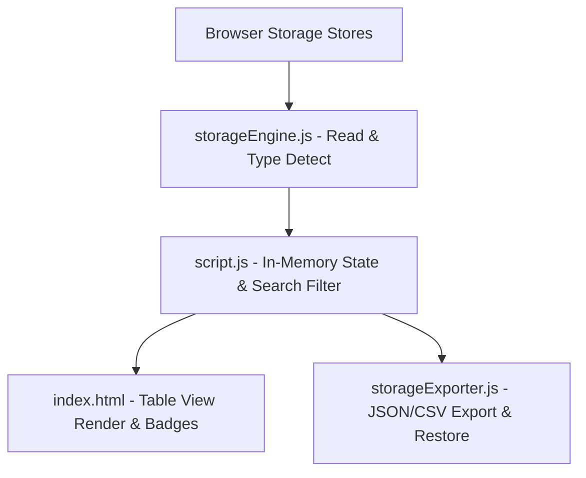

# Browser Storage Inspector Architecture

## Overview

Browser Storage Inspector & Backup Manager is a client-side dev tool that inspects, searches, filters, edits, and backs up data across LocalStorage, SessionStorage, Cookies, and IndexedDB stores.

---

## Folder Structure

```text
projects/dev-tools/browser-storage-inspector/
├── ARCHITECTURE.md    # System architecture and maintenance documentation
├── index.html         # HTML layout, summary cards, search toolbar, storage forms
├── storageEngine.js   # Storage data type detection, byte footprint calculation, store reader
├── storageExporter.js # JSON and CSV export serializers and snapshot validation
├── script.js          # Controller script, DOM event handlers, tab navigation
└── style.css          # Responsive dashboard styling, badge tags, form controls
```

---

## System Architecture



---

## Component Breakdown

| File | Role |
| --- | --- |
| `storageEngine.js` | Data type detection (JSON, JWT, Base64, String, Number), byte size estimation, store reading. |
| `storageExporter.js` | JSON snapshot creation, CSV serialization, backup restoration validation. |
| `script.js` | Main app controller, event routing, form submissions, DOM table rendering. |
| `index.html` | Dashboard layout, search & filter toolbar, storage tab sections, input forms. |
| `style.css` | Glassmorphic cards, data type badge colors, responsive table wrappers. |
