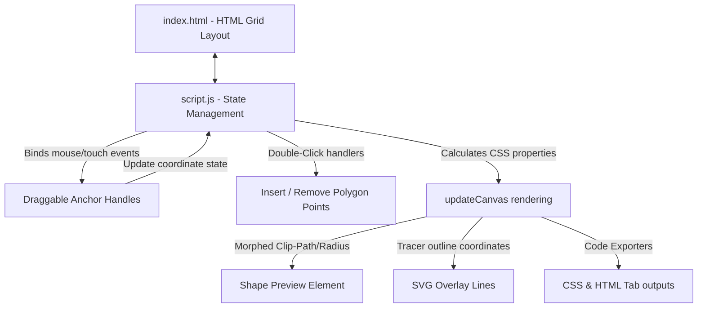

# Project Architecture — CSS Shape Designer

This document explains the architecture and working of the **CSS Shape Designer** project located in `projects/editor/css-shape-designer/`.

---

## Overview

The **CSS Shape Designer** is a visual web editor that enables developers to design complex CSS shapes, including polygons (`clip-path`), organic blobs (`border-radius`), circles, and ellipses. Users can morph shapes dynamically using on-canvas drag-and-drop handle coordinates, customize background properties (solid color, gradients, images, and glow shadows), and instantly export clean copy-paste CSS code.

---

## Purpose & Goals

- **Visual Polygon Reshaping**: Support visual editing of custom polygon paths with options to add vertices (double-click canvas) and remove vertices (double-click handles).
- **Blob Morpher**: Model border-radius blob morphing on-canvas by rendering horizontal and vertical edge handles, linking them to the 8 components of `border-radius: tl-h tr-h br-h bl-h / tl-v tr-v br-v bl-v`.
- **Glow Shadow filter**: Solve the issue where CSS `box-shadow` is clipped by `clip-path` by styling outer glows using the CSS `filter: drop-shadow(...)` property.
- **Pure Responsive Client Rendering**: Leverage percentage-based coordinate layout models to ensure shape previews and draggable anchors adjust automatically on all screen sizes.

---

## Folder Structure

```
css-shape-designer/
├── ARCHITECTURE.md  # System overview and implementation specs
├── index.html       # UI structures, settings sidebar, canvas and exporter tabs
├── script.js        # Mouse/touch interaction loops, preset values, code builders
└── style.css        # Canvas grids, grab anchor handles, toast popups, responsive styles
```

---

## System / Project Architecture Overview

The application utilizes a classic Event-Driven Architecture model:



To achieve precise cursor tracking, `script.js` listens to `mousedown`/`touchstart` on the anchor elements, and attaches `mousemove`/`touchmove` and `mouseup`/`touchend` listeners to the `document` object. This prevents cursor "slipping" where anchor dragging stops when the cursor momentarily moves faster than the DOM element.

---

## Component Breakdown

| File | Responsibility |
|---|---|
| `index.html` | Page structure, settings sidebar (radii, colors, gradients, image input), visual canvas target area, and generated code tabs. |
| `script.js` | Anchor coordinates, blob borders math, circle centers/radii calculations, touch/drag handlers, presets, clipboard copy, and toast popups. |
| `style.css` | Glassmorphism card backgrounds, coordinate checkerboards, anchor drag cursors, tab active indicators, and slide-up toast animations. |

---

## Data Flow / Execution Flow

```
Page loads and initializes default polygon shape state
        ↓
Generates coordinate selectors and presets in sidebar
        ↓
User drags handle or adjusts slider
        ↓
Calculates container relative percentages and updates state
        ↓
Re-renders shape-preview properties (clip-path, border-radius, background, drop-shadow)
        ↓
Draws dash-array lines on SVG tracing overlays
        ↓
Compiles clean CSS text code outputs to exporter textareas
```

---

## Key Features

- **Draggable On-Canvas Anchors**: Drag handles to morph polygons, blobs, and circle radii.
- **Mobile Touch Compatibility**: Full swipe/drag support on touch screens.
- **Multi-Shape Modes**:
  - **Polygon**: Freeform polygon editor with point addition/deletion.
  - **Blob**: 8-point fancy border-radius blob morpher.
  - **Circle / Ellipse**: Handles for centers (`cx, cy`) and radii (`r`, `rx`, `ry`).
- **Style Customizers**: Select solid color backgrounds, linear gradients with angle controls, background image URLs, and drop-shadow glow filters.
- **Export Formats**: Select either CSS code properties or complete HTML elements.
- **Clipboard Utility**: Copy with single clicks accompanied by confirmation toasts.

---

## Technologies Used

| Technology | Purpose |
|---|---|
| HTML5 | Semantic structure, input select/range options. |
| CSS3 | Grid layouts, drop-shadow filters, slider track selectors, and toast animations. |
| Vanilla JavaScript (ES6) | Coordinate clamping, drag-and-drop math, clipboard copy, and point insertion. |
| Font Awesome 6.5.1 | Icon vector graphics. |
