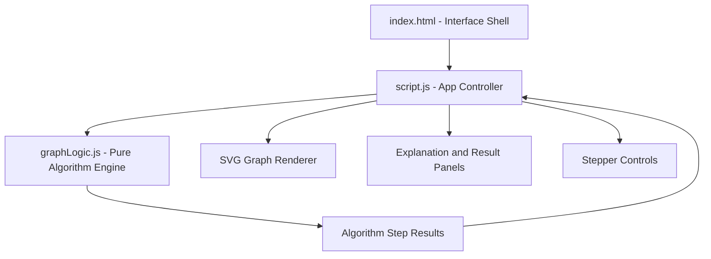

# Project Architecture - Graph Theory Explorer

This document describes the architecture and structure of the **Graph Theory Explorer** project located in `projects/math/graph-theory-explorer/`.

---

## Overview

Graph Theory Explorer is an interactive graph visualization tool for learning traversal and pathfinding algorithms. Users can add nodes, connect weighted edges, generate a random graph, and step through BFS, DFS, Prim's Minimum Spanning Tree, and Dijkstra's shortest path.

---

## Folder Structure

```text
projects/math/graph-theory-explorer/
+-- ARCHITECTURE.md    # Architecture documentation and implementation notes
+-- graphLogic.js      # Pure graph algorithms used by the UI and Node tests
+-- index.html         # App shell, controls panel, canvas workspace, and result panels
+-- script.js          # DOM controller, graph editing, rendering, and animation stepper
+-- style.css          # Responsive layout, graph canvas styles, cards, and theme styling
+-- thumbnail.svg      # Project thumbnail graphic
```

---

## System Architecture



---

## Component Breakdown

| File            | Role                                                                                                                                    |
| --------------- | --------------------------------------------------------------------------------------------------------------------------------------- |
| `index.html`    | Defines the control panel, algorithm buttons, node selectors, SVG canvas, explanation area, and result panel.                           |
| `style.css`     | Handles visual design, responsive layout, graph canvas styling, cards, controls, and theme presentation.                                |
| `script.js`     | Manages DOM state, user interactions, node/edge editing, random graph creation, algorithm selection, rendering, and animation playback. |
| `graphLogic.js` | Contains testable graph algorithms with no DOM dependency: adjacency building, BFS, DFS, Prim's MST, and Dijkstra.                      |

---

## Data Flow

```text
User edits graph or selects an algorithm
        |
        v
script.js updates in-memory nodes and edges
        |
        v
graphLogic.js computes algorithm steps/results
        |
        v
script.js stores the step sequence for playback
        |
        v
SVG canvas, explanation text, and result panel update per step
```

---

## State Model

The project keeps graph state in browser memory:

```text
nodes: [{ id, x, y }]
edges: [{ from, to, weight }]
selectedAlgorithm: "bfs" | "dfs" | "mst" | "dijkstra"
currentMode: "add-node" | "add-edge"
steps: algorithm visualization timeline
currentStepIndex: active step in the timeline
```

`graphLogic.js` works with a pure algorithm shape:

```text
nodes: [{ id }]
edges: [{ from, to, weight }]
```

This separation keeps the algorithm layer independent from canvas coordinates and DOM rendering.

---

## Algorithm Layer

`graphLogic.js` exposes:

- `buildAdjacency(nodes, edges)` for creating an undirected weighted adjacency map.
- `bfs(nodes, edges, startId)` for breadth-first traversal steps.
- `dfs(nodes, edges, startId)` for depth-first traversal steps.
- `primMST(nodes, edges, startId)` for minimum spanning tree steps and total weight.
- `dijkstra(nodes, edges, startId, endId)` for shortest-path distances, path output, and relaxation steps.

The functions return structured step objects such as `visit`, `frontier-edge`, `tree-edge`, `settle`, and `relax`, which the UI uses to highlight graph elements during playback.

---

## Rendering Strategy

The SVG canvas is redrawn from the current `nodes`, `edges`, and active algorithm step. `script.js` applies visual classes and labels to communicate visited nodes, active edges, tree edges, settled nodes, and relaxed paths.

Playback controls use the generated step list to move forward, backward, restart, or automatically play through the visualization at the selected speed.

---

## Testing Notes

The graph algorithms are isolated in `graphLogic.js`, allowing Node tests to import and validate the algorithm behavior without requiring a browser DOM or SVG canvas.
