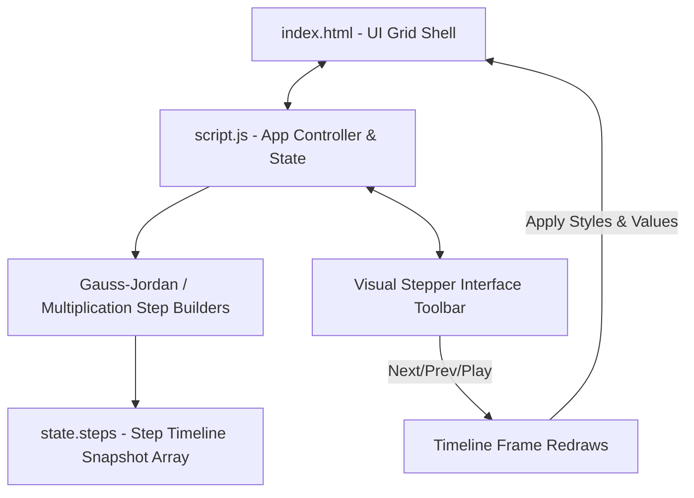

# Project Architecture — Matrix Operations Playground

This document explains the architecture and working of the **Matrix Operations Playground** project located in `projects/math/matrix-playground/`.

---

## Overview

The **Matrix Operations Playground** is an interactive, browser-based mathematical playground that allows users to perform core matrix operations (Addition, Multiplication, Determinant, Inverse, and Transpose) while visualizing the mathematical computations step-by-step. The application runs entirely on the client side with no external dependencies.

---

## Purpose & Goals

- **Interactive Learning**: Demystify matrix algebra by showing how each cell is calculated through animated overlays and real-time step explanations.
- **State-Based Step-by-Step Traversal**: Support full playback control (play, pause, next step, previous step, and speed control) with a time-travel style snapshot state mechanism.
- **Visual Grid Alignment**: Align cells and equations with clear color coding to connect the input matrices directly to the result equations.

---

## Folder Structure

```
matrix-playground/
├── ARCHITECTURE.md  # Architectural documentation and specifications
├── index.html       # The responsive HTML user interface structure
├── script.js        # The state machine and step-by-step playback engine
└── style.css        # The glassmorphic layout, styling, and grid highlights
```

---

## System / Project Architecture Overview

The project relies on a clean separation of concerns and a time-travel timeline state design pattern:



Instead of modifying the live DOM elements incrementally and trying to undo operations when step-backing, `script.js` pre-generates a sequence of static **step snapshots** whenever the matrix values or selected operations change. Each step snapshot retains:

1. The exact matrix values of `A`, `B`, and `C` at that frame.
2. The CSS highlight class maps (`row`, `col`, `active`, `inactive`) for each cell.
3. The custom visual explanation text and formula markup.

To traverse the steps, the visual stepper simply loads the corresponding snapshot values and classes back onto the DOM grids.

---

## Component Breakdown

| File         | Responsibility                                                                                                                    |
| ------------ | --------------------------------------------------------------------------------------------------------------------------------- |
| `index.html` | Page structure, sidebar controls, preset action triggers, visual playback toolbar, and grid placeholder containers.               |
| `script.js`  | Dimension synchronization, preset loading, step generators, operation arithmetic, timeline interval management, and DOM bindings. |
| `style.css`  | Flex/Grid styling, bracket decorations, keyframe pulse animations, custom slider inputs, and responsiveness rules.                |

---

## Data Flow / Execution Flow

```
User opens index.html or edits an element
        ↓
Initialize grid templates and default presets
        ↓
User selects operation and inputs matrix data
        ↓
Inputs trigger a state reset and pre-generate the step queue
        ↓
User clicks Play or Next Step
        ↓
Stepper index advances and loads the corresponding snapshot state
        ↓
Grid cell values are redrawn and highlight classes are applied to inputs
        ↓
Final step shows the completed calculation and final result matrix
```

---

## Key Features

- **Multi-Operation Suite**:
  - **Addition**: Visualizes corresponding element addition.
  - **Multiplication**: Highlights dot product rows/cols and aggregates sum terms.
  - **Determinant**: Supports expansion along the first row for 2x2 and 3x3 matrices.
  - **Inverse**: Implements Gauss-Jordan Elimination showing intermediate row reductions on the augmented matrix `[A|I]`.
  - **Transpose**: Shows matrix transposition across diagonals.
- **Visual Stepper Controls**: Play, Pause, Step Back, Step Forward, Reset, and a linear speed slider (300ms to 2.5s).
- **Responsive Theme Compatibility**: Fully compatible with Cradle light/dark themes using global design tokens.
- **Input Presets**: Generate random integers, load identity matrix presets, or clear matrices.

---

## Technologies Used

| Technology               | Purpose                                                      |
| ------------------------ | ------------------------------------------------------------ |
| HTML5                    | Semantic structure and accessibility markup.                 |
| CSS3                     | Flexbox, CSS Grid layouts, custom transition animations.     |
| Cradle Design Tokens     | Shared theme styling variables for light/dark modes.         |
| Vanilla JavaScript (ES6) | Step generation, matrix arithmetic, state management.        |
| Font Awesome 6.5.1       | Icon vector graphics for the operation buttons and controls. |
