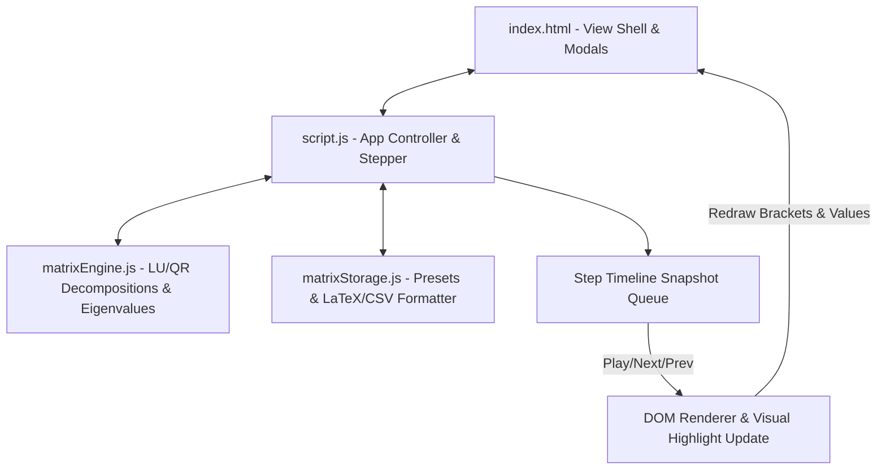

# Project Architecture — Matrix Operations & Decomposition Playground

This document details the architecture and structure of the **Matrix Operations & Decomposition Playground** project located in `projects/math/matrix-playground/`.

---

## Overview

The **Matrix Operations & Decomposition Playground** is an interactive linear algebra workbench allowing users to perform core matrix operations (Addition, Multiplication, Determinant, Inverse, Transpose) along with advanced matrix decompositions (**LU Decomposition**, **QR Decomposition**) and **Eigenvalue Spectral Analysis**.

---

## Folder Structure

```text
projects/math/matrix-playground/
├── ARCHITECTURE.md    # Architectural documentation and specifications
├── README.md          # Usage instructions, formula descriptions, and project features
├── index.html         # HTML layout, controls, grid placeholders, and export modal
├── matrixEngine.js    # Linear algebra calculations (LU, QR, Eigenvalues, Inverses)
├── matrixStorage.js   # Matrix presets catalog, LocalStorage persistence, LaTeX/CSV export
├── script.js          # DOM controller, event handlers, and step playback stepper
├── style.css          # Glassmorphic layout, matrix brackets, animation keyframes
└── thumbnail.svg      # Project thumbnail graphic
```

---

## System Architecture



---

## Component Breakdown

| File               | Role                                                                                                               |
| ------------------ | ------------------------------------------------------------------------------------------------------------------ |
| `matrixEngine.js`  | Pure mathematical calculation engine for LU decomposition, QR decomposition, eigenvalues, determinants, and inverses.|
| `matrixStorage.js` | Preset catalog (Identity, Rotation, Shear, Hilbert, Magic Square), LocalStorage cache, and LaTeX/CSV formatting. |
| `script.js`        | Interactive UI controller, event listener setup, animation stepper management, and DOM grid rendering.             |
| `index.html`       | Interface layout, operation buttons, dimension selectors, visual timeline controls, and LaTeX export modal.       |
| `style.css`        | Design tokens, grid layouts, responsive rules, modal overlays, and animation keyframes.                           |

---

## Data & Computation Flow

```text
User selects Operation / Presets / Matrix Dimensions
                     ↓
`matrixEngine.js` performs matrix computations (LU, QR, Det, Inv, Eigen)
                     ↓
`script.js` builds step-by-step animation snapshots
                     ↓
`matrixStorage.js` serializes outputs for LaTeX / CSV export dialogs
                     ↓
DOM render updates result matrix grid & step progress bar
```
