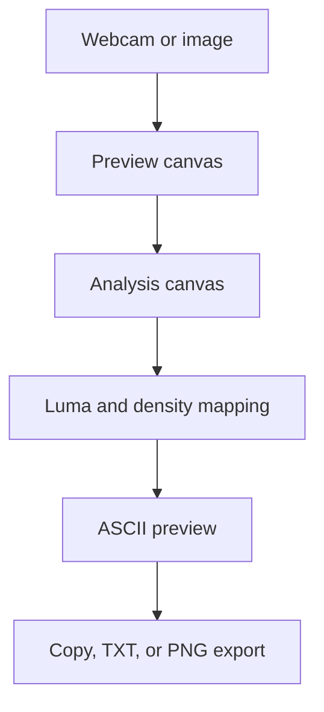

# ASCII Camera Architecture

## Overview

ASCII Camera is a browser-only mini-project that converts either a webcam frame or an uploaded image into ASCII art. The app keeps all processing client-side with Canvas APIs, so it does not need a backend or package dependencies.

## Project Structure

| File | Purpose |
| --- | --- |
| `index.html` | Defines the controls, source preview, ASCII output panel, hidden analysis canvas, and script/style links. |
| `style.css` | Implements the responsive Cradle-aligned interface, control layout, preview panels, and export toast styling. |
| `script.js` | Handles webcam access, image upload, canvas sampling, ASCII conversion, live rendering, copy, TXT export, and PNG export. |
| `README.md` | Documents features, run steps, manual testing, and dependencies. |

## Data Flow

## Rendering Model

1. A webcam frame or uploaded image is drawn to the visible preview canvas.
2. The same source is downsampled to the hidden analysis canvas using the selected column count.
3. Each sampled pixel is converted to luminance.
4. Brightness, contrast, invert, and optional ordered dithering are applied.
5. The adjusted luminance value selects a character from the active density ramp.
6. The app stores plain text rows and color-aware row data for export.

## Design Decisions

- The project uses vanilla JavaScript to match the existing Cradle mini-project style.
- Webcam rendering is throttled with the FPS slider to keep CPU usage controlled.
- PNG export draws the stored ASCII rows onto a temporary canvas instead of screenshotting the page, giving a clean image output.
- Color ASCII is optional because plain monochrome output is easier to copy and read in terminals.
- Camera access gracefully falls back to upload mode when permissions or browser support are unavailable.

## Limitations

- Webcam access requires browser permission and usually needs localhost or HTTPS.
- Very high column counts can generate wide ASCII output and larger PNG exports.
- The PNG export uses a fixed monospace font size for predictable image dimensions.

## Future Improvements

- Add drag-and-drop image upload.
- Add preset themes for exported PNGs.
- Add a short GIF-style frame recorder for live camera clips.
- Add Web Worker processing if very large frame sizes are introduced.
