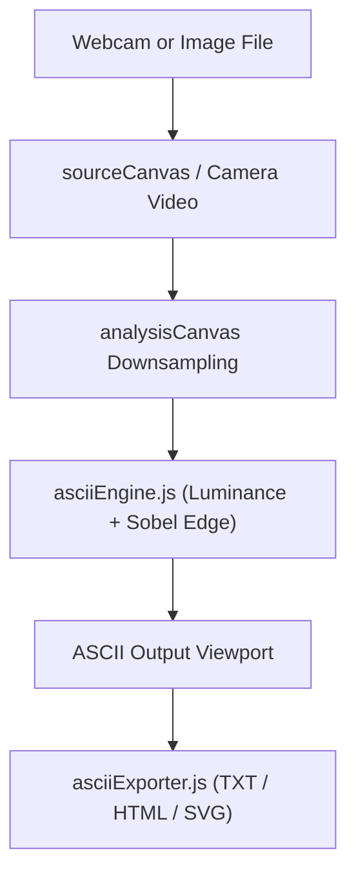

# ASCII Camera Studio Architecture

## Overview

ASCII Camera Studio is a client-side web application that transforms webcam video feeds and local image files into ASCII art with customizable character ramps, Sobel edge detection contouring, and multi-format export tools (TXT, HTML, SVG, PNG).

---

## Folder Structure

```text
projects/misc/ascii-camera/
├── ARCHITECTURE.md   # System architecture and data flow specifications
├── README.md         # Documentation, feature highlights, and controls
├── index.html        # HTML layout, controls panel, source preview, ASCII output
├── asciiEngine.js    # Core image processing, Sobel edge detection, palette mapping
├── asciiExporter.js  # Format serializers for TXT, HTML document, and SVG vector
├── script.js         # Camera stream loop, UI controller, event bindings
├── style.css         # Glassmorphic layout styling, character picker pills, responsive rules
└── thumbnail.svg     # Project thumbnail graphic
```

---

## System Architecture



---

## Component Breakdown

| File | Role |
| --- | --- |
| `asciiEngine.js` | Luminance calculation, character palette mapping, contrast adjustment, Sobel edge filter. |
| `asciiExporter.js` | Multi-format serialization: plain text (`.txt`), styled HTML (`.html`), and SVG vector (`.svg`). |
| `script.js` | Media stream lifecycle, frame animation loop, DOM binding, export triggers. |
| `index.html` | Page structure, video frame, canvas elements, slider controls, export action bar. |
| `style.css` | CSS tokens, responsive flex/grid layouts, dark theme palette, typography styles. |
