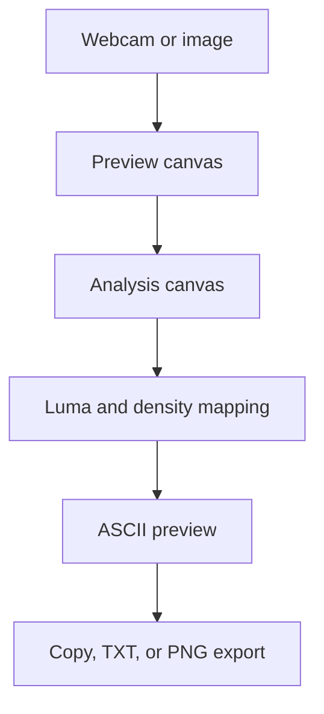

# ASCII Camera Architecture

## Overview

ASCII Camera is a browser-only mini project that converts either a webcam feed or an uploaded image into ASCII art. Users can tune density, columns, brightness, contrast, color, and dithering, then copy the result or export it as `.txt` or `.png`.

The project runs entirely on native browser APIs. No backend, framework, or package dependency is required.

---

## Purpose & Goals

- Convert webcam frames into live ASCII art in the browser.
- Convert uploaded image files into still ASCII art.
- Provide useful density and image adjustment controls for readable output.
- Support text export and PNG image export.
- Keep the project small, dependency-free, and easy for new contributors to inspect.

---

## Project Structure

```text
ascii-camera/
├── ARCHITECTURE.md  # Project architecture, usage notes, testing notes, and maintenance details
├── index.html       # Entry point, controls, source preview, ASCII output, and hidden analysis canvas
├── script.js        # Webcam/image handling, ASCII conversion, state, rendering, and export logic
├── style.css        # Responsive Cradle-aligned layout and ASCII camera styling
└── thumbnail.svg    # Generated project thumbnail used by the Cradle project gallery
```

---

## System / Project Architecture Overview

The project follows a static frontend architecture. `index.html` defines the page shell and controls, `style.css` handles the responsive interface, and `script.js` owns all media processing, DOM updates, and export behavior.



---

## Component Breakdown

| File | Purpose |
| --- | --- |
| `index.html` | Defines the controls, source preview, ASCII output panel, hidden analysis canvas, and script/style links. |
| `script.js` | Handles webcam access, image upload, canvas sampling, ASCII conversion, live rendering, copy, TXT export, and PNG export. |
| `style.css` | Implements the responsive Cradle-aligned interface, control layout, preview panels, and export toast styling. |
| `thumbnail.svg` | Generated by `npm run build` through `scripts/generate-projects.js`. |

---

## Data Flow / Execution Flow

```text
User opens index.html
        |
Browser loads tokens.css, style.css, Button.js, BackToHome.js, and script.js
        |
script.js caches DOM elements, initializes labels, and attaches event listeners
        |
User starts camera, uploads an image, or loads the sample
        |
Selected source is drawn to the preview canvas and downsampled to analysisCanvas
        |
Each pixel is converted to luminance, adjusted, mapped to a density character, and rendered
        |
User copies text, downloads TXT, or exports PNG
```

---

## Key Features

- Live webcam-to-ASCII rendering with adjustable FPS.
- Uploaded image support for still-frame conversion.
- Character density presets: Soft, Classic, Bold, and Binary.
- Column count, contrast, brightness, invert, color, and dither controls.
- Source preview beside the ASCII output.
- Copy ASCII text to the clipboard.
- Download ASCII output as `.txt`.
- Export ASCII output as a PNG image.
- Sample ASCII output for export testing without a webcam or upload.

---

## Technologies Used

| Technology | Purpose |
| --- | --- |
| HTML5 | Page structure, form controls, preview panels, and canvas elements. |
| CSS3 | Responsive layout, Cradle token usage, control styling, and output panels. |
| Vanilla JavaScript | State management, event handling, media processing, and exports. |
| Canvas API | Draws source media, samples pixels, and creates PNG exports. |
| MediaDevices API | Requests webcam access through `getUserMedia`. |
| Clipboard API | Copies plain ASCII text to the clipboard. |
| Blob URL API | Downloads TXT and generated PNG files. |
| Cradle UI components | Applies shared button and back-to-home behavior. |

---

## File Responsibilities

### `index.html`

- Loads Cradle design tokens, the local stylesheet, and local script.
- Defines the header, status card, source controls, output controls, preview panel, and ASCII panel.
- Provides `cameraVideo`, `sourceCanvas`, and `analysisCanvas` for media processing.
- Loads shared `Button.js` and `BackToHome.js` components.

### `script.js`

- `ramps` stores the available ASCII density presets.
- `state` tracks the active source, camera stream, current ASCII text, color row data, and object URL.
- `startCamera()` requests webcam access and starts the live render loop.
- `loadImage(file)` reads an uploaded image into an `Image` source.
- `renderAscii()` samples pixels, applies brightness/contrast/dither options, maps luminance to characters, and updates the preview.
- `downloadText()` exports the current plain ASCII text as `.txt`.
- `downloadPng()` draws stored ASCII rows to a temporary canvas and exports a PNG.
- `stopCamera()` stops active media tracks and resets camera controls.

### `style.css`

- Uses Cradle design tokens with local ASCII camera variables.
- Builds the header, control panel, source preview, and ASCII output layouts.
- Keeps the ASCII output scrollable and monospace.
- Adds responsive breakpoints for tablet and mobile screens.
- Defines toast styling for copy/export feedback.

---

## Design Decisions

- **Browser-only implementation** - keeps the mini project simple and consistent with other Cradle static projects.
- **Canvas downsampling** - converts media to a smaller analysis canvas so ASCII generation stays fast.
- **FPS throttling** - limits webcam processing work and makes live rendering smoother on lower-powered devices.
- **Plain text state plus color row data** - supports clean TXT export while still allowing colorized PNG export.
- **PNG export through a temporary canvas** - avoids capturing UI chrome and exports only the ASCII artwork.

---

## Dependencies

None. This project uses only native browser APIs and existing Cradle UI files.

---

## Future Improvements

- Add drag-and-drop image upload.
- Add preset themes for exported PNGs.
- Add a short frame recorder for live camera clips.
- Move very large frame processing to a Web Worker if higher resolutions are added.

---

## Known Limitations

- Webcam access requires browser permission and usually needs localhost or HTTPS.
- Very high column counts can generate wide ASCII output and larger PNG exports.
- PNG export uses a fixed monospace font size for predictable image dimensions.

---

## Development Notes

- Open `index.html` directly for uploaded image and export testing.
- Run a local server for webcam testing because most browsers block camera access from `file://`.

```bash
python -m http.server 8000
```

Then visit:

```text
http://localhost:8000/projects/misc/ascii-camera/
```

Manual testing checklist:

- Upload an image and confirm ASCII output appears.
- Move `Columns`, `Contrast`, and `Brightness` and confirm output updates.
- Switch density presets and toggle `Invert`, `Color ASCII`, and `Dither`.
- Use `Copy Text`, `Download TXT`, and `Export PNG`.
- Start the camera on localhost, allow permission, confirm live rendering, then stop the camera.

---

## References

- [MDN Web Docs - Canvas API](https://developer.mozilla.org/en-US/docs/Web/API/Canvas_API)
- [MDN Web Docs - MediaDevices.getUserMedia](https://developer.mozilla.org/en-US/docs/Web/API/MediaDevices/getUserMedia)
- [MDN Web Docs - Clipboard API](https://developer.mozilla.org/en-US/docs/Web/API/Clipboard_API)
