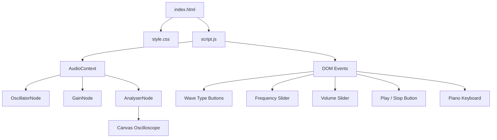

# Audio Waveform & Tone Generator Architecture

## Overview

Audio Waveform & Tone Generator is an interactive browser-based synthesiser that uses the Web Audio API to generate four waveform types (Sine, Square, Sawtooth, Triangle) with real-time oscilloscope visualisation on an HTML5 Canvas. It includes an on-screen piano keyboard spanning C4 to B4, allowing users to play notes and explore the relationship between frequency, wave shape, and timbre.

---

## Purpose & Goals

- Demonstrate browser-based audio synthesis using native Web Audio API (OscillatorNode, GainNode, AnalyserNode)
- Provide an interactive oscilloscope that visualises waveform shape in real time
- Offer a playable piano keyboard for musical exploration of pitch and frequency
- Keep the project dependency-free and self-contained for easy learning and modification

---

## Folder Structure

```
audio-waveform-generator/
├── index.html       # Entry point: controls, canvas, piano keyboard
├── style.css        # Dark-theme styling matching misc conventions
├── script.js        # All application logic (Web Audio, Canvas, UI)
├── ARCHITECTURE.md  # This file
├── thumbnail.svg    # Project card thumbnail for the gallery
└── README.md        # Quick-start documentation
```

---

## System / Project Architecture Overview

The project follows a single-script architecture where `script.js` owns both the Web Audio API logic and the UI orchestration. There is no build step — the browser loads files directly.



---

## Component Breakdown

| File         | Responsibility                                                                                                             |
| ------------ | -------------------------------------------------------------------------------------------------------------------------- |
| `index.html` | Page shell: wave type toggles, sliders, play button, canvas, piano keyboard container                                      |
| `script.js`  | Audio context initialisation, oscillator/gain/analyser wiring, canvas rendering loop, piano key builder, UI event handlers |
| `style.css`  | Dark-theme layout, controls panel, canvas section, piano keys, responsive breakpoints                                      |

---

## Data Flow / Execution Flow

```

User opens index.html
↓
Browser loads style.css → script.js
↓
script.js builds piano keyboard from NOTE_NAMES data
↓
Canvas is sized and cleared with center reference line
↓
User selects wave type → currentWave updated → oscillator type changed (if playing)
User adjusts frequency → oscillator.frequency updated live
User adjusts volume → gainNode.gain updated live
↓
User clicks Play (or piano key)
↓
AudioContext created (first interaction — respects autoplay policy)
↓
OscillatorNode → GainNode → AnalyserNode → destination connected
↓
requestAnimationFrame loop starts
↓
Each frame:
  analyser.getByteTimeDomainData(dataArray)
  canvas is cleared and waveform drawn as connected line segments
  peak level displayed in header
↓
User clicks Stop (or Space) → oscillator/analyser disconnected → canvas cleared

```

---

## Key Features

- Four waveform types: Sine, Square, Sawtooth, Triangle — toggled via segmented buttons
- Frequency control from 20 Hz to 2000 Hz via slider with live numeric readout
- Volume control from 0% to 100% with live percentage readout
- Real-time oscilloscope display using AnalyserNode byte time-domain data
- On-screen piano keyboard (C4–B4) — click a key to hear the note and see its frequency
- Keyboard shortcuts: Space = Play/Stop, 1–4 = wave types, A–J = piano keys (A=C4, S=D4, D=E4, F=F4, G=G4, H=A4, J=B4)
- Canvas glow effect on the waveform for visual polish
- Peak level indicator showing instantaneous amplitude

---

## Technologies Used

| Technology                        | Purpose                                                 |
| --------------------------------- | ------------------------------------------------------- |
| HTML5                             | Page structure and semantic markup                      |
| CSS3 (Flexbox, Custom Properties) | Layout, slider styling, responsive design               |
| Vanilla JavaScript (ES6+)         | Audio synthesis, Canvas rendering, event handling       |
| Web Audio API                     | OscillatorNode, GainNode, AnalyserNode                  |
| Canvas API                        | Real-time waveform drawing with `requestAnimationFrame` |

---

## File Responsibilities

### `index.html`

- `.controls-panel` — houses wave type selector, frequency/volume sliders, and play button
- `.canvas-section` — contains the `<canvas id="waveform">` element for the oscilloscope
- `.piano-section` — container for the dynamically-built piano keyboard
- Google Fonts link for Outfit (UI) and JetBrains Mono (data readouts)

### `script.js`

- `initAudio()` — creates `AudioContext`, wires `OscillatorNode → GainNode → AnalyserNode → destination`
- `start()` / `stop()` / `togglePlay()` — play state management
- `updateOscillator()` — updates oscillator type and frequency in real time
- `updateVolume()` — updates gain value in real time
- `drawWaveform()` — `requestAnimationFrame` loop; reads `getByteTimeDomainData()` and draws the waveform on canvas with glow
- `resizeCanvas()` / `clearCanvas()` — canvas sizing and blanking
- `buildPiano()` — generates piano key DOM elements from the `NOTES` array
- `playNote(note, freq, keyEl)` — sets oscillator frequency, starts playback if stopped, applies visual highlight
- Keyboard shortcuts: Space, 1–4, A–J mapped to controls and piano notes
- `NOTES` constant — C4 through B4 frequencies in equal temperament (A4 = 440 Hz)
- Event listeners for wave buttons, sliders, play button, mouse/touch on piano keys

### `style.css`

- Dark-theme CSS variables: `#0a0e1a` base, `#111827` card, `#7c3aed` accent (violet)
- Wave toggle button group with active gradient state
- Range slider custom thumb styling using `::-webkit-slider-thumb` and `::-moz-range-thumb`
- Piano key styling with active press state (scale transform + glow)
- Responsive breakpoints at 700px and 480px for mobile

---

## Design Decisions

- **Single-script architecture** — the project is small enough that separating logic.js from script.js would add complexity without benefit. All Web Audio, Canvas, and UI code lives in one file.
- **Lazy AudioContext creation** — the AudioContext is created on the first Play or piano key press, respecting browser autoplay policies that require user gesture before audio can start.
- **AnalyserNode for visualisation** — `getByteTimeDomainData()` provides 1024 samples of the waveform at 128-sample intervals, giving a smooth oscilloscope trace with minimal CPU overhead.
- **Canvas glow effect** — `ctx.shadowColor` + `ctx.shadowBlur` adds a subtle violet glow to the waveform, improving visual feedback without performance impact.
- **Keyboard shortcuts** — piano keys mapped to A–J (home row) for a quick-play experience without a mouse. Space for play/stop, 1–4 for wave types.
- **No external dependencies** — the entire project uses only native browser APIs, keeping it dependency-free and instantly loadable.

---

## Dependencies

None. This project uses only native browser APIs (Web Audio API, Canvas API, DOM) — no external libraries are required.

---

## Future Improvements

- Add sharps/flats to the piano keyboard (black keys) for full chromatic scale
- Support MIDI input for external keyboard control
- Add an envelope (ADSR) for more expressive note articulation
- Add a spectrogram view alongside the oscilloscope
- Record and export audio to WAV using AudioWorklet or MediaRecorder

---

## Known Limitations

- Only white keys (C4–B4) are rendered on the piano keyboard; sharps and flats are not available
- Single oscillator only — no polyphony or unison detuning
- Frequency range limited to 20–2000 Hz (covers fundamental frequencies of most musical instruments but excludes ultrasonic tests)
- Canvas visualisation stops when audio is paused (no frozen waveform display)

---

## Development Notes

- Open `index.html` through a local server (e.g. `npx live-server`) for the best experience. The `file://` protocol works for basic use.
- Audio requires a user gesture (click or keypress) before the AudioContext can be created — this is a browser security requirement.
- The Web Audio API is supported in all modern browsers (Chrome, Firefox, Safari 14.1+, Edge). Safari requires `window.webkitAudioContext` as a fallback.
- No build step is required. Edit any file and refresh the browser.

---

## References

- [MDN Web Docs — Web Audio API](https://developer.mozilla.org/en-US/docs/Web/API/Web_Audio_API)
- [MDN — OscillatorNode](https://developer.mozilla.org/en-US/docs/Web/API/OscillatorNode)
- [MDN — AnalyserNode](https://developer.mozilla.org/en-US/docs/Web/API/AnalyserNode)
- [MDN — Canvas API](https://developer.mozilla.org/en-US/docs/Web/API/Canvas_API)
- [Equal temperament — Wikipedia](https://en.wikipedia.org/wiki/Equal_temperament)
